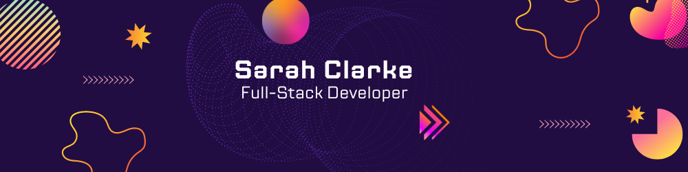

# Kia ora, I'm Sarah 👋

I'm a career changer with a background in naturopathy, sculpture, and adult education, transitioning into a career in software development. I have experience in course development, online facilitation, and team interaction, which have honed my communication and organisational skills. I'm excited to contribute my diverse skills to innovative projects and continuous learning.

## 🛠️ Skills and Tools

I am continuously expanding my skill set and currently focusing on:

### **Languages:**

  
  
  
  

### **Databases:**

  
  

### **Frameworks and Libraries:**

  
  
  
  
 

### **Tools and Platforms:**

  
  
  
  
  

### **Upcoming:**

  
  
 

## 🌱 Learning Goals

I am currently diving deeper into full-stack development, focusing on modern JavaScript frameworks and cloud services. My upcoming learning goals include mastering Python and exploring AWS for cloud computing.

## 🎯 Career Aspirations

I am excited about roles in software development that allow me to leverage my skills in both front-end and back-end technologies. I am particularly interested in positions that involve problem-solving, continuous learning, and contributing to innovative projects.

## 💬 Let's Connect

Feel free to reach out to me via:
- <a href="mailto:sarahclarke.dev@gmail.com">
  
  Email
  </a>
- <a href="https://www.linkedin.com/in/sarah-clarke-40aa8030b">
  
  LinkedIn
  </a>

---

### About Me

With a creative background, I bring a unique perspective to software development. My experience in naturopathy, sculpture, and adult education has equipped me with a holistic approach to problem-solving and a deep appreciation for continuous learning. As I transition into tech, I am eager to integrate these diverse skills into innovative software projects.

